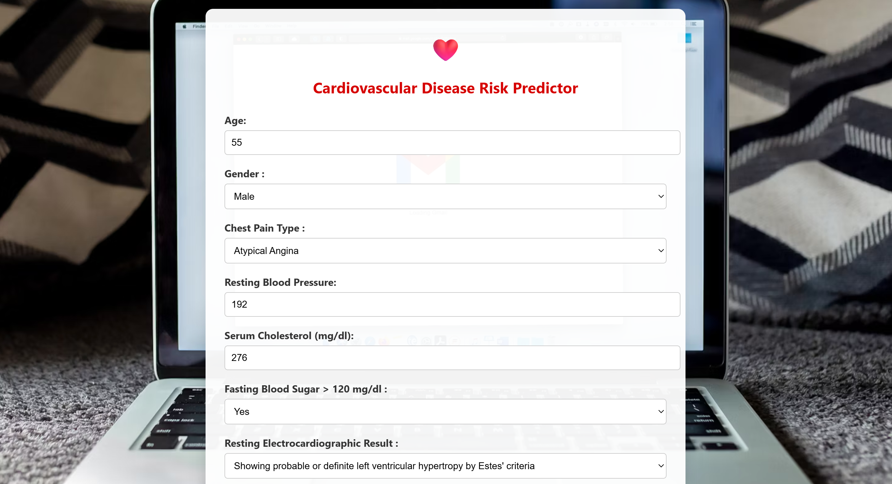
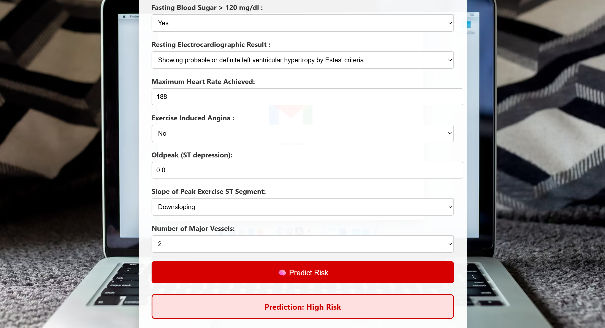

# Cardiovascular-Disease-Prediction
This project predicts the risk of cardiovascular disease using 12 health-related inputs such as age, blood pressure, cholesterol, electrocardiogram etc. It features an interactive HTML form and a neural network backend built with TensorFlow and Keras.

### Key Features
- 🧠 Neural network model with 3 hidden layers.
- 🌐 Frontend HTML form to input health data (age, blood pressure, cholesterol, etc.)
- 🔙 Backend model trained on data sourced from [Mendley Data](https://data.mendeley.com/datasets/dzz48mvjht/1).
- 📈 Binary classification (Low Risk vs High Risk).
- 💾 Trained model saved as `mymodel.h5`.

### List of 12 health metrics
- Age
- Gender
- Chest pain type
- Resting blood pressure
- Serum cholestrol
- Fasting blood sugar
- Resting electrocardiogram results
- Maximum heart rate achieved
- Exercise induced angina
- Oldpeak =ST
- Slope of the peak exercise ST segment
- Number of major vessels

Predicts the absence and presence of heart disease with "Low Risk" and "High Risk" respectively.

### 🧪 Sample Input

| Age | Gender | Chest pain type | Resting blood pressure | Serum cholesterol | Fasting blood sugar | Resting electrocardiogram results | Maximum heart rate achieved | Exercise induced angina | Oldpeak =ST | Slope of the peak exercise ST segement | Number of major vessels |
|-----|--------|--------|--------|-------|--------|-------------|---------|--------|------|--------|----------|
| 55  | 1      | 2    | 192     | 276.0   | 1     | 2           | 188       | 0      | 0.0   | 2      | 2     |

### 🎯 Sample Output
1 (High Risk)

## 📈 Model Performance

The neural network model was evaluated on a test set of 50 samples with the following results:

### ✅ Accuracy Report

- **Accuracy**: `95.7%`

### 🧮 Confusion Matrix

  | 20 | 1 |
  |----|----|
  | 3  | 26|
- 20 True Negatives : Model correctly predicted no disease
- 1 False Positives : Model predicted “disease”/1 but patient actually had no disease (false alarm)
- 3 False Negatives : Model predicted “no disease”/0 but patient actually had disease (missed case)
- 26 True Positives : Model correctly predicted disease

### 📊 Classification Report

| Class | Precision | Recall | F1-Score | Support |
|-------|-----------|--------|----------|---------|
| 0 (No Disease) | 0.87 | 0.95 | 0.91 | 21 |
| 1 (Disease)    | 0.96 | 0.90 | 0.93 | 29 |

- **Accuracy**: 0.957  
- **Macro Avg**: Precision = 0.92, Recall = 0.92, F1 = 0.92  
- **Weighted Avg**: Precision = 0.92, Recall = 0.92, F1 = 0.92

> 📌 The model performs slightly better on predicting disease cases than non-disease ones, making it useful in medical screening scenarios.

## Installation and Usage
### 🔧 Requirements
Make sure you have the following installed:
- Python 3.8, 3.9 or 3.10
- `pip` (Python package manager)
- Basic web browser (for the HTML form)

### Creating and activating a virtual environment
- `python -3.10 -m venv myenv` for creating the virtual environment
- `myenv/Scripts/activate` for activating the virtual environment

### 📦 Install Dependencies
`pip install -r requirements.txt`

### 🚀 Running the Project
- `python app.py`
- `Running on http://127.0.0.1:5000` Open that link in your browser to see your app in action.

 ### 🖼️ Screenshot
 

 
 

##

### 🤝 Contributing
Contributions are welcome! Feel free to fork this repository, make changes, and submit a pull request.

### 🙋‍♂️ Contact
For questions or feedback, feel free to reach out via [goyalayush1203@gamil.com] or open an issue in the repository.

---
Feel free to explore, modify, and enhance the project. Happy coding! 🚀
